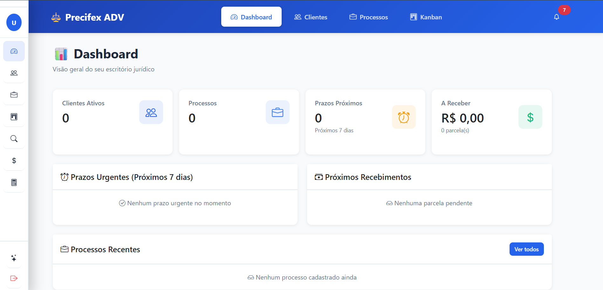

# Observações de Ambiente Local

Para rodar o projeto localmente sem redirecionar para produção, foi necessário ajustar `sistemas/config.php` em dois pontos. Abaixo seguem a referência de arquivo e linhas com o antes/depois.

## rotas
> * Criar novo usuário
```
http://localhost/www/juridico-php/index.php?aba=novo_usuario
```
> * acesso local:
http://localhost/www/v2/login.php

> * acesso externo: 
```
https://adv.precifex.com/
```
## preview




## criar banco
criar_new_db.sql

## usuário padrão
🔐 Credenciais do Usuário Padrão:
Email: rodrigoexer2@gmail.com
Senha: 123123
Telefone: 62998579084
Licença: Ativa até 31/12/2027

## Ajuste de URLs base

- Arquivo: [sistemas/config.php](sistemas/config.php#L30-L60)

Como era:

```php
// URLs do sistema
define('BASE_URL', 'https://precifex.com/sistemas');
define('LOGIN_URL', BASE_URL . '/index.php');
define('DASHBOARD_URL', BASE_URL . '/dashboard.php');
define('LOGOUT_URL', BASE_URL . '/logout.php');
```

Como ficou (detecta `localhost/127.0.0.1` e usa caminhos locais):

```php
// URLs do sistema (ajuste para ambiente local vs produção)
$__host = $_SERVER['HTTP_HOST'] ?? '';
$__isLocal = preg_match('/^(localhost|127\\.0\\.0\\.1)(:\\d+)?$/', $__host) === 1;

if ($__isLocal) {
    // Base local: ajuste conforme seu DocumentRoot
    // Estrutura detectada: c:\\xampp\\htdocs\\www\\juridico-php -> http://localhost/www/juridico-php
    $__scheme = 'http://';
    $__baseLocal = $__scheme . $__host . '/www/juridico-php';
    define('BASE_URL', $__baseLocal);
    define('LOGIN_URL', BASE_URL . '/index.php');
    // Dashboard local está em views/dashboard.php
    define('DASHBOARD_URL', BASE_URL . '/views/dashboard.php');
    define('LOGOUT_URL', BASE_URL . '/index.php?logout=1');
} else {
    define('BASE_URL', 'https://precifex.com/sistemas');
    define('LOGIN_URL', BASE_URL . '/index.php');
    define('DASHBOARD_URL', BASE_URL . '/dashboard.php');
    define('LOGOUT_URL', BASE_URL . '/logout.php');
}
```

Motivo: evitar que `redirecionarPara()` envie para produção durante o desenvolvimento local, mantendo navegação em `http://localhost/...`.

## Ajuste do cookie de sessão (HTTP vs HTTPS)

- Arquivo: [sistemas/config.php](sistemas/config.php#L452-L470)

Como era:

```php
ini_set('session.cookie_httponly', 1);
ini_set('session.cookie_secure', 1);
ini_set('session.use_strict_mode', 1);
```

Como ficou (aplica `cookie_secure` somente em HTTPS):

```php
ini_set('session.cookie_httponly', 1);
$https = (!empty($_SERVER['HTTPS']) && $_SERVER['HTTPS'] !== 'off') || (isset($_SERVER['SERVER_PORT']) && $_SERVER['SERVER_PORT'] == 443);
ini_set('session.cookie_secure', $https ? 1 : 0);
ini_set('session.use_strict_mode', 1);
```

Motivo: em ambiente local (HTTP), `cookie_secure=1` impede o cookie de sessão de ser enviado, causando falha ao manter login e redirecionamentos inesperados.
